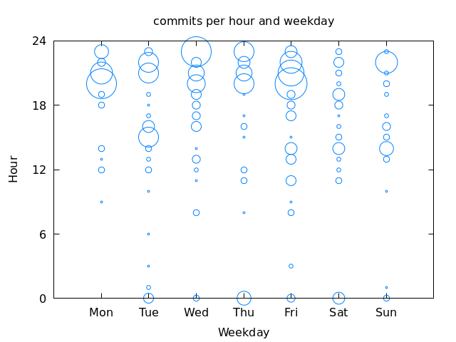

# `git hours`

`git-hours` visualizes Git temporal commit patterns. It outputs a graph
of commit frequency by weekday and hour of the repo in the current
directory.

## Usage

* Put `git-hours` on your path.
* Call `git hours`. Any arguments will be passed on to `git log`, e.g.
  `git hours --all`, or `git hours --since=1.year.ago`.
* Open `hours.png`.

## Example

## Dependencies

* A POSIX shell
* awk
* GNUPlot

<!-- vim: set tw=72: -->
